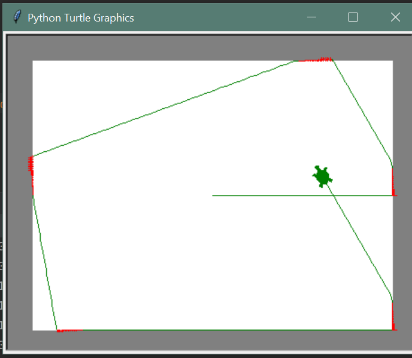

# Explication:
La trajectoire de la tortue s'explique par le fait que cette dernière change de trajectoire à chaque fois qu'elle croise un "mur".
Cette action se manifeste au travers du robot par : Lorsque le robot croise un changement de luminosité (bande noire au sol), elle s'arrête, recule et change 
de trajectoire. 

# Trajectoire: 
